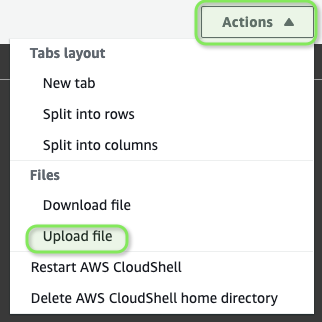
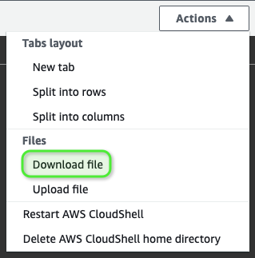
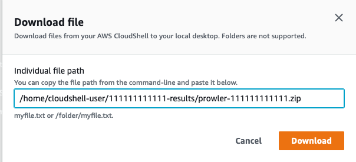

# ShortCut

ShortCut - Run Prowler and ScoutSuite in Customer's environment using AWS CloudShell

### Use Case:

Customers look to use multiple auditing tools in order to provide quick assessments about their AWS environments. These tools allow for reports to be generated for review by the customer and appropriate teams, which in turns helps them begin security remediation efforts. 

Prowler and ScoutSuite are two publicly available security auditing tools that provide comprehensive reports for customers using AWS.

ShortCut is a mechanism for customers to use to run both Prowler and ScoutSuite within an AWS account, using AWS CloudShell. When customers use ShortCut, this allows for customers to quickly perform an audit on their environment, without having to provision IAM Access Keys or EC2 instances. 

### Prerequisites:

Note: The current version of this script is ran in a single account.

In order to use CloudShell, the customer will need the following permissions within their AWS Account:
```
cloudshell:*
```

In addition, the following IAM Policies are needed in order to run ScoutSuite & Prowler:
```
arn:aws:iam::aws:policy/SecurityAudit
arn:aws:iam::aws:policy/job-function/ViewOnlyAccess
```

### Instructions
1. Log into the AWS Console
2. Go to AWS CloudShell. There's a screenshot of the AWS CloudShell icon below, or if you're logged into AWS already, you can click this link: console.aws.amazon.com/cloudshell


3. Once the session begins, upload the shortcut.sh file into the AWS CloudShell session by selecting Actions -> Upload File.



4. Once the file is uploaded, run the following command within your AWS CloudShell session:
```
bash shortcut.sh
```
5. The results for Prowler and ScoutSuite will be located in the following directory:
```
/home/cloudshell-user/<account number>-results
```
6. You can check the status of each screen session by typing the following commands:
```
# Prowler:
screen -r prowler
# ScoutSuite
screen -r scoutsuite
```
7. To download the results from AWS CloudShell, select Actions -> Download File.



8. In the Download File prompt, use the file path and file name to download the results.

